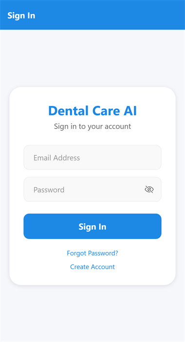
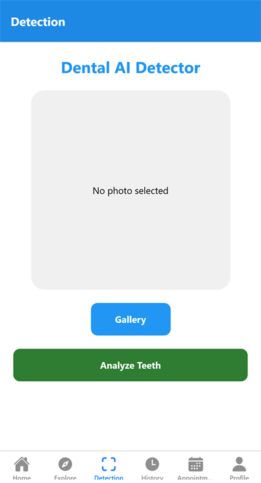
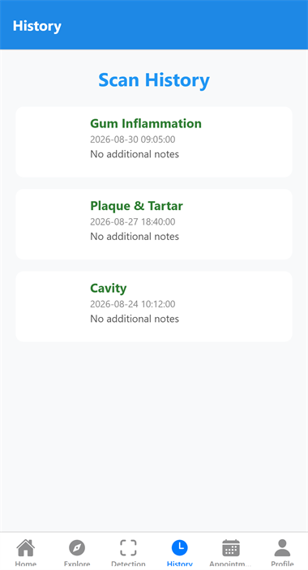
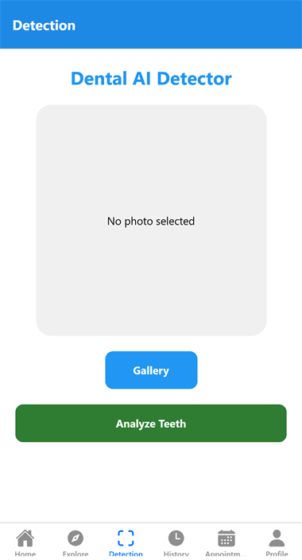
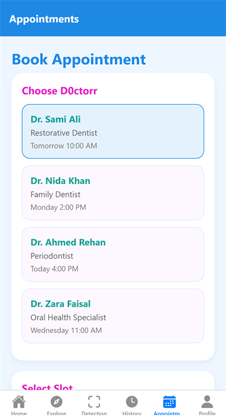
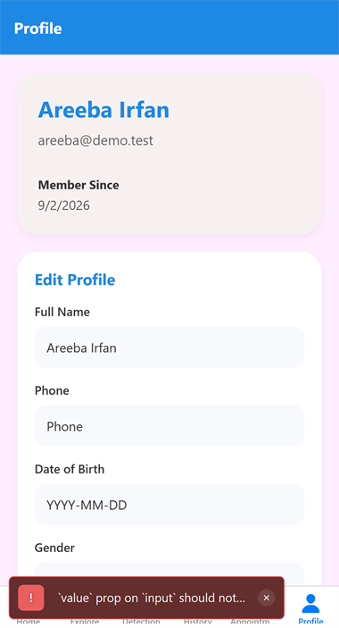

<div align="center">

# 🦷 Dental Disease Detection

**Point your phone at a tooth and get an AI-assisted read on what might be wrong — then book a dentist about it.**

[](https://docs.expo.dev/versions/v54.0.0/)
[](https://reactnative.dev/)
[](https://www.typescriptlang.org/)
[](https://www.php.net/)
[](https://www.sqlite.org/)
[](#-how-the-ai-works)

</div>

---

## 📌 Overview

**Dental Disease Detection** turns a phone camera into a first-pass dental screening tool. A patient photographs a tooth, the image goes to a vision model, and the app returns the conditions it thinks it can see — each with a confidence score. Every scan is saved to a personal history, and the patient can book a dentist appointment from the same app.

Built as a **final-year project**, it is a complete system: an Expo/React Native client, a PHP REST API, and an AI layer that runs against either a hosted vision model or your own trained dental model.

> ⚠️ **This is a screening aid, not a diagnosis.** Model output is a suggestion for a qualified dentist to confirm. It should never drive a treatment decision on its own.

---

## 📸 Screenshots

| Sign in | Detection | Scan history |
|:---:|:---:|:---:|
|  |  |  |

| Home | Appointments | Profile |
|:---:|:---:|:---:|
|  |  |  |

---

## ✨ Features

| Feature | What it does |
|---|---|
| 📷 **Camera scan** | Capture a tooth with the in-app camera, or pick an existing photo |
| 🧠 **AI detection** | Vision model returns suspected conditions with confidence scores |
| 📊 **Scan results** | Findings laid out per condition and saved against the account |
| 🕓 **History** | Every past scan with its image and result, reviewable any time |
| 📅 **Appointments** | Book, view and manage dentist appointments |
| 👤 **Profile** | Account details, editable, with a change history |
| 🔐 **Auth** | Email sign-up, sign-in, bearer-token sessions, password recovery |

---

## 🏗️ Architecture

```
Expo / React Native app   (camera, results, history, appointments)
          │  HTTP + Bearer token
          ▼
PHP REST API  ──  api/auth · detection · history · appointments · profile
          │                    │
          │                    └─ ai_analyzer.php
          ▼                              │
   SQLite (dental_ai.db)                 ├─ hosted vision model  (OPENAI_API_KEY)
   6 tables                              └─ your own model       (DENTAL_AI_URL)
```

The client never talks to the AI provider directly. The key stays on the server, and `ai_analyzer.php` is the only file that knows which provider is in use — so swapping models changes nothing in the app.

### 🧠 How the AI works

`backend/ai_analyzer.php` picks a provider at runtime, in this order:

1. **`OPENAI_API_KEY` set** → the image is base64-encoded and sent to a hosted vision model.
2. **`DENTAL_AI_URL` set** → the image is posted to your own trained dental model instead (for example a Flask service).
3. **Neither set** → the API returns `503` with a clear message.

That third branch matters: with no model configured the app refuses rather than inventing a result.

---

## 📂 Project Structure

```
Dental-Disease-Detection/
├── app/                       # Expo Router screens
│   ├── index.tsx              #   Entry
│   ├── signin.tsx             #   Sign in
│   ├── signup.tsx             #   Create account
│   ├── forgot-password.tsx    #   Password recovery
│   ├── cvscanner.tsx          #   Camera scanner
│   ├── scan-result.tsx        #   AI findings for one scan
│   └── (tabs)/
│       ├── index.tsx          #   Home
│       ├── detection.tsx      #   Start a scan
│       ├── history.tsx        #   Past scans
│       ├── appointments.tsx   #   Bookings
│       └── profile.tsx        #   Account
├── services/
│   ├── BackendService.ts      # API client
│   └── storage.ts             # Local session storage
├── components/                # Shared UI
├── backend/                   # PHP REST API
│   ├── api/
│   │   ├── auth.php           #   signup · signin · logout
│   │   ├── detection.php      #   upload image -> AI -> stored result
│   │   ├── history.php        #   past scans
│   │   ├── appointments.php   #   bookings
│   │   └── profile.php        #   account
│   ├── ai_analyzer.php        #   Provider selection and vision calls
│   ├── schema.php             #   Table definitions
│   ├── setup_db.php           #   Creates the SQLite database
│   ├── dental_ai.db           #   GENERATED — git-ignored
│   └── uploads/               #   Scan images — git-ignored
└── app.json
```

---

## 🗄️ Database

SQLite, six tables created by `setup_db.php`:

| Table | Holds |
|---|---|
| `users` | Accounts and hashed passwords |
| `sessions` | Bearer tokens |
| `detection_history` | One row per scan |
| `detection_results` | The conditions found in a scan |
| `appointments` | Bookings |
| `profile_history` | Changes made to a profile |

---

## 🚀 Getting Started

### Prerequisites
- **Node.js 18+** and npm
- **PHP 8+** with `sqlite3`, `curl` and `openssl` enabled
- The [Expo Go](https://expo.dev/go) app, or an Android/iOS emulator
- An API key for a hosted vision model — **or** your own dental model behind an HTTP endpoint

### 1. Clone and install

```bash
git clone https://github.com/areebairfan535-cmyk/Dental-Disease-Detection.git
cd Dental-Disease-Detection
npm install
```

### 2. Configure the backend

```bash
cd backend
cp .env.example .env
```

Open `.env` and set **one** of these:

```env
# Option A — hosted vision model
OPENAI_API_KEY=your_openai_api_key_here
OPENAI_VISION_MODEL=gpt-4.1-mini

# Option B — your own trained model instead
# DENTAL_AI_URL=http://127.0.0.1:5000
```

> 🔐 **Never commit `.env`.** It holds a live API key and is already listed in `.gitignore`.

### 3. Create the database and run the API

```bash
php setup_db.php          # builds dental_ai.db with all six tables
php -S 0.0.0.0:8000       # run from the backend/ folder
```

### 4. Run the app

```bash
cd ..
npx expo start
```

Press `a` for Android, `i` for iOS, or scan the QR code with Expo Go.

> 📱 On a physical phone, point the app at your machine's LAN address rather than `127.0.0.1`, and start PHP on `0.0.0.0` so the phone can reach it.

---

## 📡 API Reference

Base URL: `http://<host>:8000/api`

| Method | Endpoint | Body / Header |
|---|---|---|
| `POST` | `/auth.php?action=signup` | `{email, username, password, full_name}` |
| `POST` | `/auth.php?action=signin` | `{email, password}` → returns a token |
| `POST` | `/auth.php?action=logout` | `{token}` |
| `POST` | `/detection.php` | image upload · `Authorization: Bearer <token>` |
| `GET` | `/history.php` | `Authorization: Bearer <token>` |
| `GET` `POST` | `/appointments.php` | `Authorization: Bearer <token>` |
| `GET` `PUT` | `/profile.php?action=profile` | `Authorization: Bearer <token>` |

Full backend notes are in [`backend/README.md`](backend/README.md).

---

## 🗺️ Roadmap

- [ ] Train and ship a dedicated dental model instead of a general vision model
- [ ] Record a short demo video
- [ ] Dentist-side view of submitted scans
- [ ] Offline queue so a scan taken without signal uploads later
- [ ] Move uploads off local disk into object storage

---

## 👩‍💻 Author

**Areeba Irfan**
IT Graduate · Mobile App & Full-Stack Developer

---

<div align="center">

Final-year project. Screening aid only — always confirm with a dentist.

</div>
